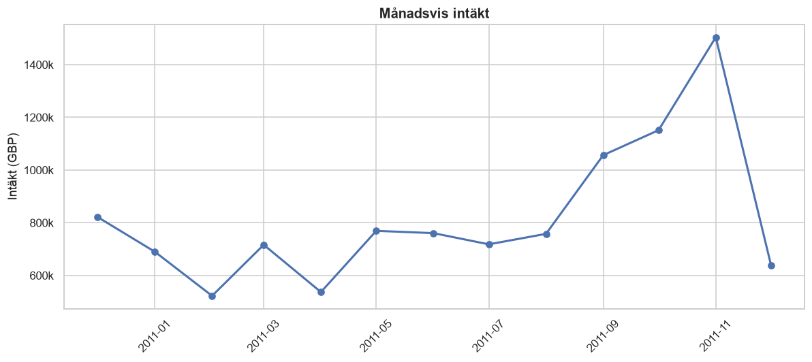
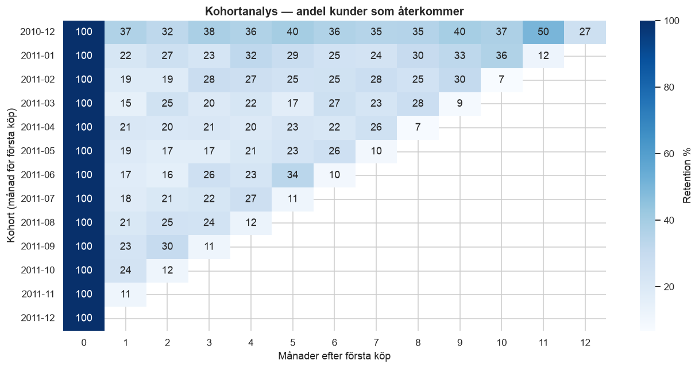
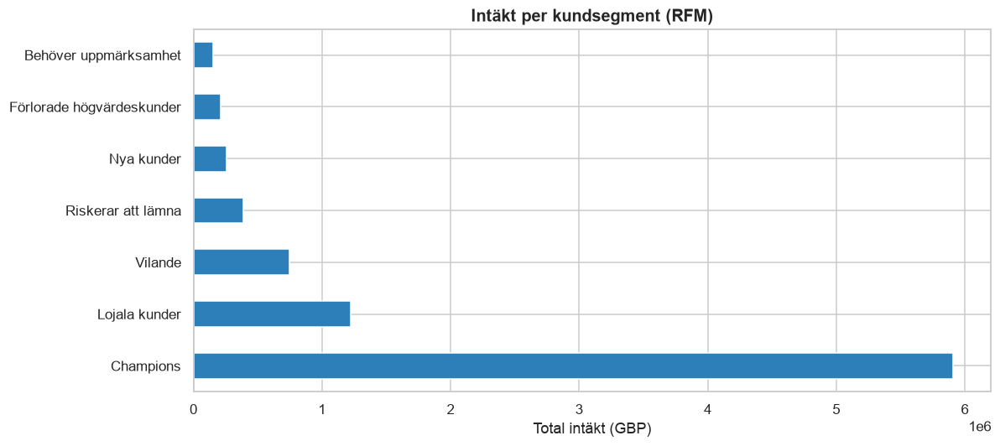

# Retail Analytics med SQL

Analys av 541 909 e-handelstransaktioner med DuckDB. Jag byggde en dimensionell datamodell från rådata och besvarade ett antal affärsfrågor med SQL — window functions, CTE:er, kohortanalys och RFM-segmentering.

## Datamodell

Star schema med en faktatabell och tre dimensioner:

| Tabell | Rader | Beskrivning |
|---|---|---|
| `fact_sales` | 534 129 | Transaktionsrader med kvantitet, pris och intäkt |
| `dim_product` | 3 828 | Produktkod och beskrivning |
| `dim_customer` | 4 371 | Kund-ID och land |
| `dim_date` | 305 | Datumdimension med år, månad, veckodag |

Utöver tabellerna finns tre analytiska views: `v_monthly_kpi`, `v_customer_rfm` och `v_product_performance`.

## Tekniker

Projektet använder window functions som RANK, NTILE, LAG och ROW_NUMBER, samt running totals med explicit frame. Kohortanalysen kedjar fyra CTE:er efter varandra, inklusive en självrefererande join för att räkna ut kohortstorlek. RFM-segmenteringen är gjord i ren SQL med NTILE(5) istället för i pandas, vilket kändes som ett bättre sätt att visa att man faktiskt kan databasen och inte bara pandas.

## Resultat i urval



Andelen kunder som återkommer per månad efter första köp:



Intäkt fördelad över kundsegment:



## Insikter

Intäkten är tydligt säsongsberoende, med november som toppmånad inför julhandeln och januari–februari som svagast. Den översta decilen av kunder står för en oproportionerligt stor andel av intäkten, vilket gör att ett lojalitetsprogram riktat mot de mest värdefulla kunderna troligen skulle löna sig.

Retention faller mycket efter första månaden och planar sedan ut, så om man vill behålla kunder verkar de första 30 dagarna vara avgörande. Storbritannien dominerar intäkten totalt sett, men snittordervärdet är faktiskt högre på flera av exportmarknaderna. Returgraden skiljer sig också en hel del mellan produkter, vilket kan tyda på kvalitetsproblem hos vissa artiklar snarare än ett generellt mönster.

## Datakvalitet

Rådatan hade en del problem som behövde städas innan analysen:

| Problem | Antal rader | Åtgärd |
|---|---|---|
| Exakta dubbletter | 5 268 | Borttagna |
| Saknad produktbeskrivning | 1 454 | Borttagna |
| Saknat kund-ID | 135 080 | Behållna för intäktsanalys, exkluderade i kundanalys |
| Makulerade ordrar | 9 288 | Flaggade, inte borttagna — analyseras separat |

## Struktur

retail-sql-analytics/
├── notebooks/
│ ├── 01_build_database.ipynb # ETL och datamodellering
│ └── 02_analysis.ipynb # Analys och visualisering
├── sql/ # Fristående SQL-filer
├── images/ # Genererade diagram
├── requirements.txt
└── README.md

## Köra projektet

```bash
python3 -m venv .venv && source .venv/bin/activate
pip install -r requirements.txt
```

Ladda ner datasetet från Kaggle och lägg det i `data/raw/online_retail.csv`, kör sedan:

```bash
jupyter notebook
```

Kör `01_build_database.ipynb` först, sedan `02_analysis.ipynb`.

## Teknikstack

Python, DuckDB, pandas, matplotlib, seaborn, Jupyter